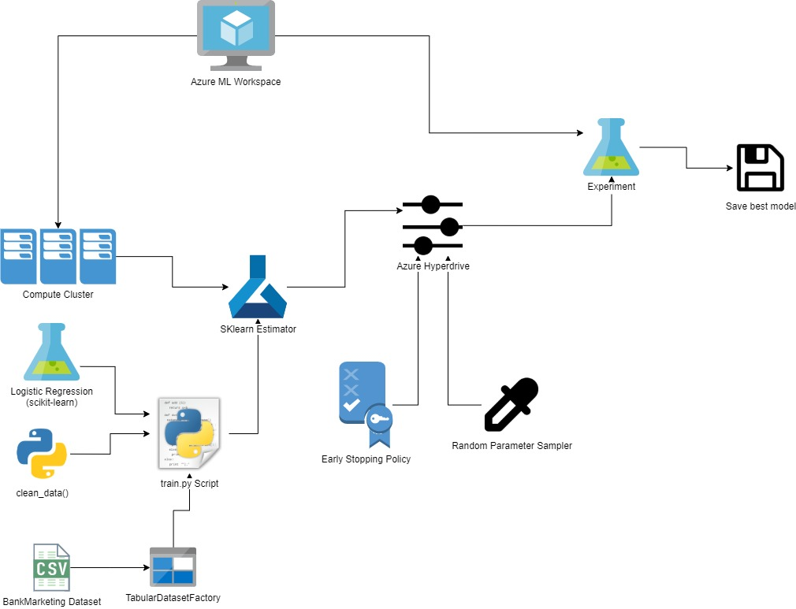
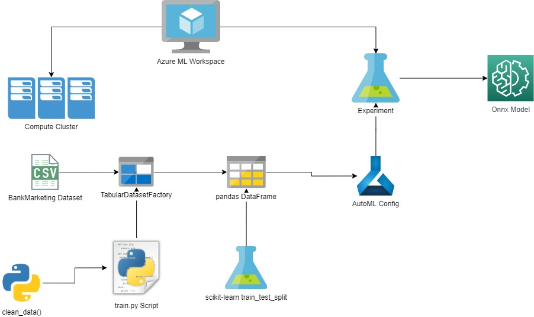
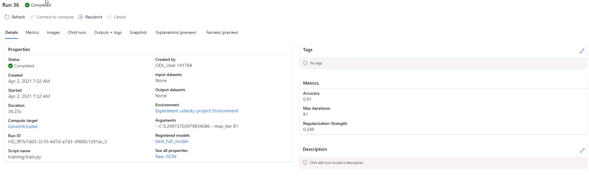
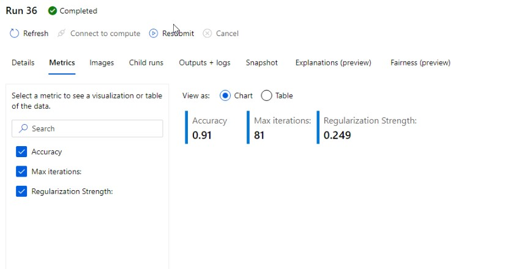
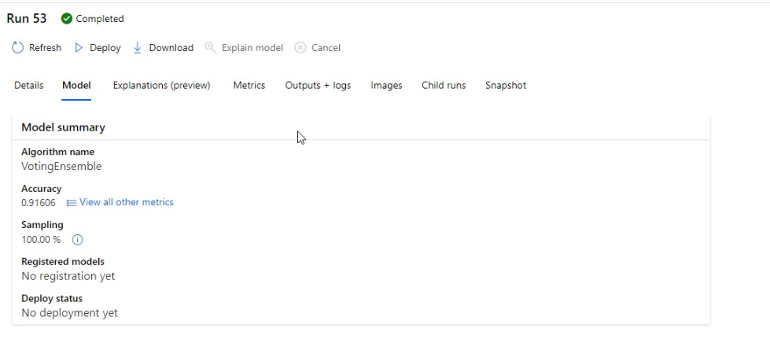
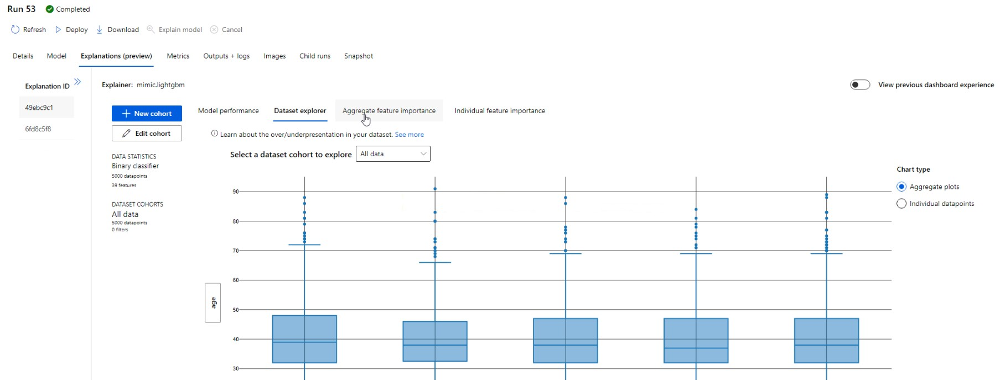
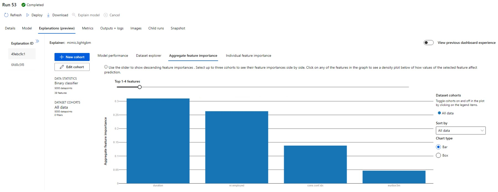
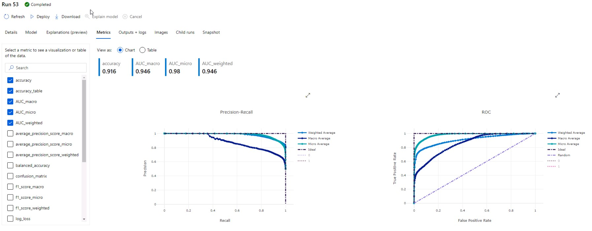

# Optimizing an ML Pipeline in Azure

## Overview
This project is part of the Udacity Azure ML Nanodegree.
In this project, we build and optimize an Azure ML pipeline using the Python SDK and a provided Scikit-learn model.
This model is then compared to an Azure AutoML run.

## Summary
This project uses the UCI Bank Marketing dataset, which contains demographic (i.e.: age, education, etc.) and financial (i.e.: loans, housing, consumer price index, etc.) as well as other (e..g: previouse campaing outcome) information about potential customers for bank's marketing campain. Our goal is to predict if the customer answers "yes" or "no" to term deposit. To this end we will use classification algorithms in Azure in 2 ways: using Hyperdrive, and using AutoML.

The best performing model was the AutoML trained VotingEnsemble with 0.916 Accuracy, only slightly above the Logistic Regresion from scikit-learn that we tuned with Hyperdrive and got 0.910 Accuracy.

## Scikit-learn Pipeline
1. Preparing environment and resources

In the Scikit-learn pipeline we first set-up Workspace and an Experiment, then we spun up a 'Standard D2 V2' compute cluster.

2. Preparing data and estimator

We used our train.py Python script to:
* read in the BankMarketing CSV into a TabularDatasetFactory dataset;
* clean the data (drop unnecessary columns, one-hot-encode categorical columns, etc.);
* split the data into training and test sets;
* Parse arguments as hyperparameters into scikit-learn's Logistic regression classification algorithm.

Next, we used the compute cluster and the train.py script to set up the SKLearn estimator instance.

3. Tune hyperparameters and train classification algorithm

We set up a Random Parameter Sampler to randomly choose values for the 2 paramaters of our scikit-learn classification algorithm (C, the inverse of regularization strength, and max_iter, the maximum iterations taken to converge).

Then, we used BanditPolicy for our early stopping policy used to cancel runs based on a slock factor, or distance from best performing run.

Next, we used the estimator, early stopping policy and random parameter sampler, and others as our configuration for Hyperdrive to tune the hyperparameters of the classification algorithm.

Finally, we used hyperdrive as input into the Experiment in order to train our model, find the best run based on 'Accuracy' as our primary metric and save the model using joblib, and register it to our workspace.

See below diagram of the Scikit-Learn Pipeline:

**What are the benefits of the parameter sampler you chose?**
The main benefit of Random Parameter Sampling is efficient in both time and resources by picking random values to use for hyperparameters and it yields almost the same performance as Grid Sampling, which is an exhaustive search of all possible value combinations. It is also better for savings compared to the Bayesian Sampling, which picks samples based on previous runs, thus it needs to be bugdeted accordingly.

**What are the benefits of the early stopping policy you chose?**
The BanditPolicy early stopping cancels runs if they exceed a set distance from the best run. The main benefit of this policy it can be used for more aggressive savings with a small slack (like 0.1 used by us). It only keeps the most promising runs and saves costs, run times, and resources.

## AutoML
**In 1-2 sentences, describe the model and hyperparameters generated by AutoML.**
The best model found by AutoML was a VotingEnsemble with an accuracy of 0.916 with the below hyperparameters and ensemble algorithms used:

{'ensembled_iterations': '[0, 20, 31, 19, 27, 5, 9, 4]',
 'ensembled_algorithms': "['LightGBM', 'XGBoostClassifier', 'XGBoostClassifier', 'LightGBM', 'XGBoostClassifier', 'RandomForest', 'LogisticRegression', 'RandomForest']",
 'ensemble_weights': '[0.3076923076923077, 0.15384615384615385, 0.07692307692307693, 0.07692307692307693, 0.15384615384615385, 0.07692307692307693, 0.07692307692307693, 0.07692307692307693]',
 'best_individual_pipeline_score': '0.9131636938467347',
 'best_individual_iteration': '0',
 'model_explanation': 'True'}

See below diagram of the AuroML Pipeline:

## Pipeline comparison
**Compare the two models and their performance. What are the differences in accuracy? In architecture? If there was a difference, why do you think there was one?**
NOTE: The primary metric used was Accuracy, though not very appropriate for an imbalanced dataset, it was chosen because Weighted AUC could not be made to work properly in Hyperdrive. (for an overview of metrics for imbalanced datasets see: https://machinelearningmastery.com/tour-of-evaluation-metrics-for-imbalanced-classification/).

The model was found by AutoML, the VotingEnsemble, with 0.916 accuracy compared to 0.910 for the Logistic Regression from scikit-learn. The main differences between the 2 approaches were the standard, out-of-the-box hyperaparameters chosen for Logistic Regression, and thus a smaller sample space because this approach would be used rather for an exploratory run to find a baseline to improve. Whereas, AutoML had more than 3x runtime and used multiple algorithms, then settled on an ensemble one which is bound to at least match an out-of-the-box Logistic Regression. One other reason for the slight improved performance would be the freedom of trying out a multitude of value combinations for multiple algorighms. And finally, one last reason is the data preparation step, which was minimal for the scikit-learn approach, but more extensive for AutoML, including an dataset balancing step.

Below are some screenshots of metrics for the scikit-learn model:

Next, we have screenshots of AutoML's model metrics, explanations and feature importance:

## Future work
**What are some areas of improvement for future experiments? Why might these improvements help the model?**
In future experiments, we work on a more robust data preparation and featurization for the scikit-learn approach. We could also expand the hyperparameter search space.
